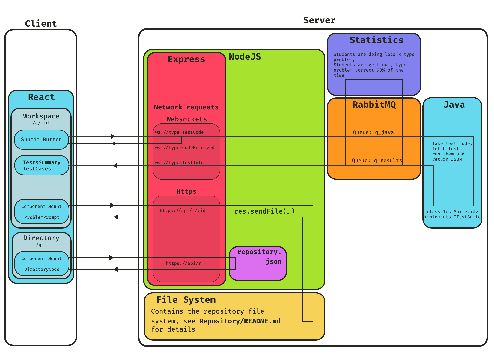

# PraticeLit
A modern version of PracticeIt designed to operate smoother and scale better

# Architecture
This repo contains the Client and NodeJS code.

# Installation, Usage, and Build Instructions

## Building individual services:
  * Web: run `npm run build` inside Web/
  * JavaTestRunner: run './gradlew jar

## Running individual services:
`npm run run:[rmq/web/jtr]` will run any of the individual services. This requires rabbitmq installed on the computer and the individual services built.

## Running the entire application:
The application can be ran using docker-compose, to do this run:
  * `docker-compose build`
  * `docker-compose up`

## More information
see `README.md` in the `Web/` and `JavaTestRunner/` directories for their respective in depth instructions. 
